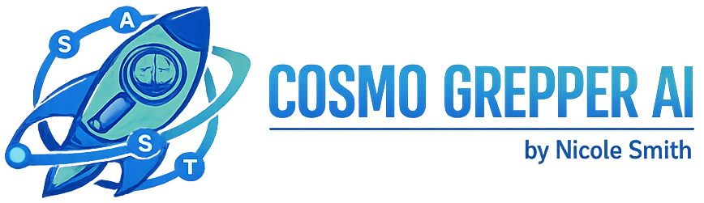

<div align="center">
  
  
  
  
  
  <br><br>
  <a href="https://buymeacoffee.com/appsecninja32" target="_blank"></a>
</div>

<br />

<div align="center">
    
    <h1 align="center">CosmoGrepper Scanner</h1>
    <p align="center">A Next-Generation AppSec UI Built on Semgrep, Local LLMs, and Risk Scoring.</p>
</div>

---

**CosmoGrepperAI** is a highly polished, open-source application security scanner designed to dramatically outperform raw static analysis tools.

### Why CosmoGrepperAI is Better Than Standalone Semgrep
Standard Semgrep is an incredibly powerful engine, but out-of-the-box it produces thousands of lines of terminal noise, lacks contextual risk metrics, and forces developers to manually triage endless false positives. 
CosmoGrepperAI wraps the Semgrep engine in a dedicated intelligence layer:
*   **Zero-Noise LLM Auto-Triage**: Instead of digging through hundreds of alerts, CosmoGrepperAI pipes findings directly into local or cloud models (Ollama/LM Studio/Gemini) to mathematically prove if the finding is a False Positive.
*   **Auto-Mitigation Generation**: For every confirmed vulnerability, CosmoGrepperAI uses context-aware AI to generate explicit code-level mitigations in your exact language.
*   **Sonatype SCA Integration**: Full Software Composition Analysis for `package.json` (NPM) and `requirements.txt` (Python) using the Sonatype OSS Index.
*   **Enterprise UI Engine**: A beautiful, actionable glassmorphism interface replaces raw JSON dumps, providing dynamic CVSS scores, OWASP mapping, and one-click PDF reports.

## 🚀 Key Features

*   **Universal Semgrep Execution**: Run local rules or pull thousands directly from the Semgrep Community remote registries (`p/security-audit`, `p/secrets`, `p/owasp-top-ten`, etc.) seamlessly from the UI.
*   **Open Source Dependency Scanning (SCA)**: Advanced supply chain security powered by Sonatype OSS Index. Identify vulnerable third-party components and get patches for transitive dependencies.
*   **LLM False Positive Analysis**: Instantly pipe complex vulnerable code snippets to an AI. Choose between **Google Gemini (Cloud)** or local **Ollama (Local)** endpoints to interrogate heuristics and eradicate annoying false positives.
*   **Aesthetic UI**: A fully responsive, dark-mode focused, glassmorphism dashboard running cleanly out of FastAPI/HTML over your localhost.
*   **Dynamic Risk Matrix**: Instead of plain "Medium", findings are scored against a custom vulnerability matrix interpreting language trust, OWASP categories, and historical data patterns.
*   **PDF Exports**: Turn interactive scanning results into highly portable PDF reports.

## 📦 Installation

### 💻 Installation

#### 1. System Requirements
*   **Python 3.9+**
*   **Semgrep Engine**: 
    - **Windows**: [Install Semgrep via Pip](https://semgrep.dev/docs/getting-started/) or download the binary.
    - **macOS**: `brew install semgrep, pip install fpdf`

#### 2. Bootstrap the Environment
```bash
# Clone the repository
git clone https://github.com/appsecninja32/CosmoGrepperAI.git
cd CosmoGrepperAI

# Create virtual environment
python -m venv venv

# Activate (Windows)
venv\\Scripts\\activate
# Activate (macOS/Linux)
source venv/bin/activate

# Install dependencies
pip install -r requirements.txt
```

#### 3. Start the Dashboard
```bash
python app.py
```
Access the UI at `http://127.0.0.1:8000`

*(Note: Ensure Semgrep is accessible in your system's PATH)*

## ⌨️ Usage

Launch the interactive web dashboard natively using Uvicorn:

```powershell
python app.py
```
*(Or use `uvicorn app:app --reload` for development)*

Navigate to `http://localhost:8000` in your browser.

### Performing a Scan
1. **Target Directory**: Input an absolute path (e.g. `C:\Users\admin\dev\repo`) or relative path (`./src`).
2. **Ruleset**: Choose the rule strictness. Use `p/default` for a broad scope, or pinpoint `p/javascript` for a specific stack.
3. **LLM Validation (Optional)**: 
   - Select **Google Gemini** and input your API key to use cloud resources.
   - Select **Ollama** if you are running Llama-3/Mistral locally on port `11434`. (Leave API key parameter blank for defaults).
4. Wait for the engine to crunch the metrics! The results will populate in interactive tables.

## 📜 License

This software is provided under the **GNU General Public License v3.0 (GPLv3)**.

You are free to use it, tear it apart, and contribute changes to it—and we'd love it if you did! However, derivative works *must* also be strictly fully open source. Let's build better security tools together. See the `LICENSE` file for details.